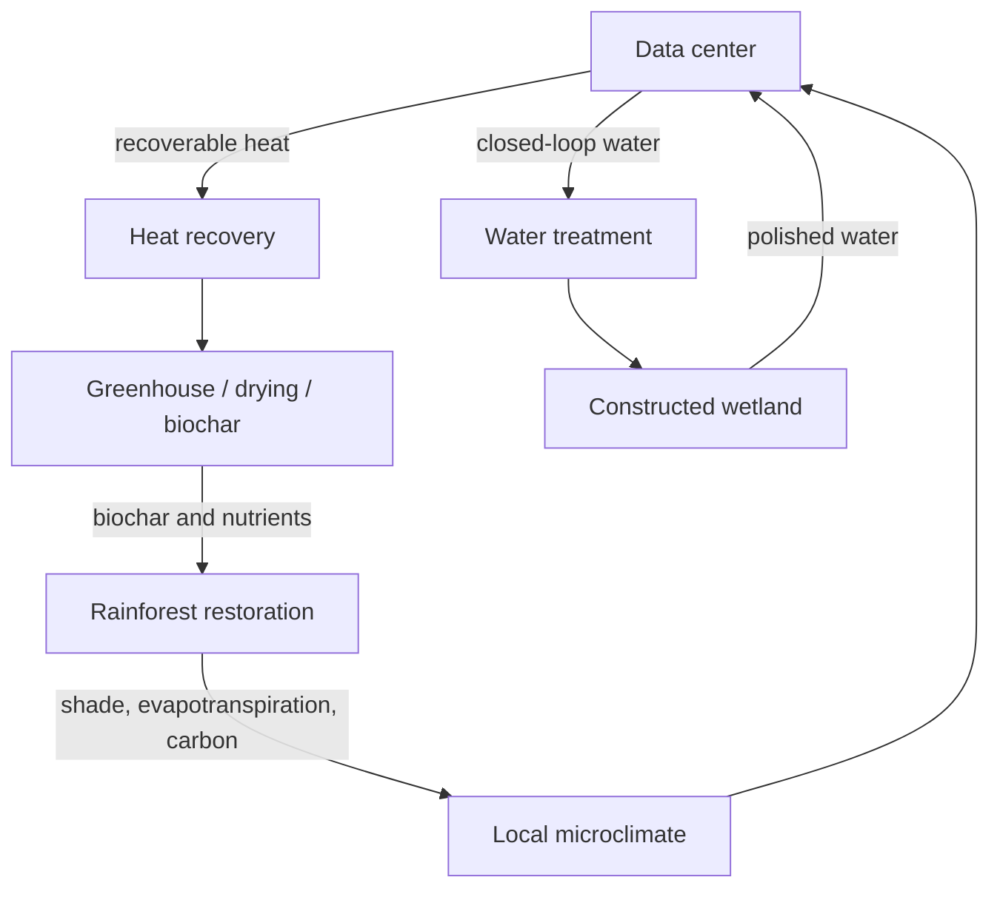

# Rainforest Data Center

An open research and engineering project exploring how data centers and tropical ecosystems could coexist as a coupled system—exchanging heat, water, carbon, and nutrients while targeting net-zero operational emissions, no consumptive freshwater loss, and measurable ecological restoration.

> **Status:** Early concept and modeling framework. Computing ultimately releases heat. The engineering goal is zero harmful net thermal impact at the defined system boundary through heat avoidance, recovery, displacement, storage, and ecosystem-compatible rejection.

## Vision

Conventional data centers treat their surroundings as a source of electricity and water and as a sink for heat. This project explores a facility designed as an ecological participant:

- renewable electricity and flexible computing loads;
- useful recovery of low-grade heat before environmental discharge;
- recirculated cooling water and rain harvesting without watershed depletion;
- constructed wetlands and biological systems for water polishing;
- reforestation, soil carbon, habitat connectivity, and local livelihoods;
- transparent mass, energy, water, and carbon accounting.

## Core architecture



## Design principles

1. Avoid intact-forest clearing; prefer degraded land or brownfields.
2. Do not compete with communities or ecosystems for water.
3. Respect thermodynamics: heat can be reused, shifted, or rejected safely—not destroyed.
4. Count construction, backup power, refrigerants, hardware, transmission, and land-use change.
5. Require additional, measurable ecological benefit.
6. Design with local and Indigenous communities.
7. Publish auditable methods, sensor data, boundaries, and uncertainty.

## Repository map

- `docs/concept.md` — system concept, boundaries, risks, and research questions
- `docs/roadmap.md` — staged path from model to field demonstrator
- `model/balance.py` — first-pass energy, water, and carbon calculator
- `model/example.json` — illustrative scenario inputs
- `CONTRIBUTING.md` — responsible contribution guidance

## Quick start

```bash
python model/balance.py model/example.json
```

## License

Apache License 2.0.
